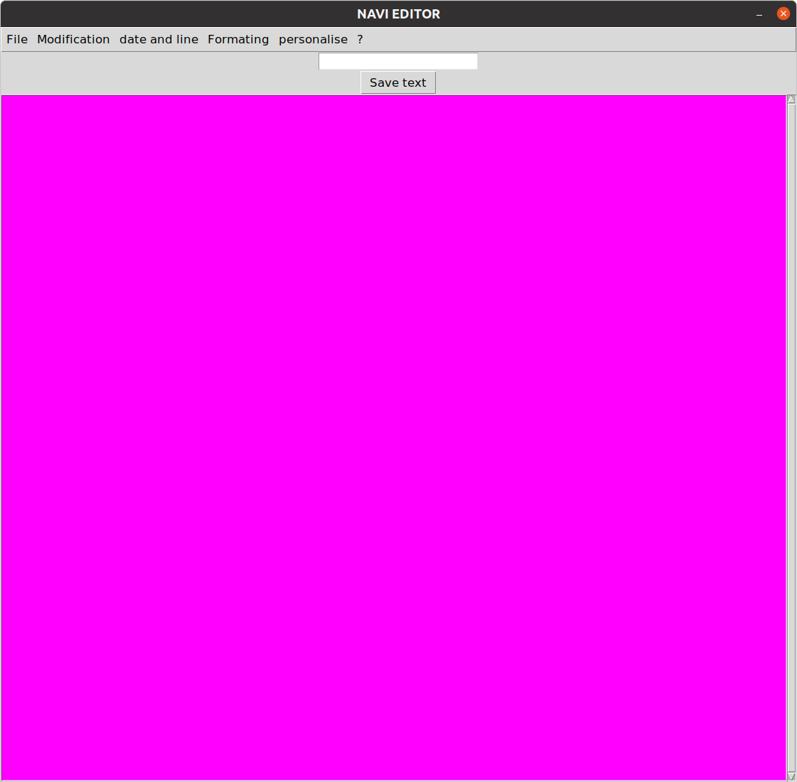

# Text-editor-in-python
A text Editor Using Tkinter



#### ==========================================================
### Function to save file
#### =========================================================
```python
def save():
    """
    files = [('All Files', '*.*'),
             ("Python Files", '*.py'),
             ("Text Documents",'*.txt')]
    """
    filename =fd.asksaveasfile(mode='w', defaultextension='.txt')
    
    if filename is None:
        return
    alltext = str(text.get(1.0,END))
    filename.write(alltext)
    filename.close()
```


##But The Open Function and The Save Function Doesn't Work But The Entry Box I created Is Use to save the text
